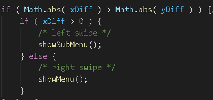
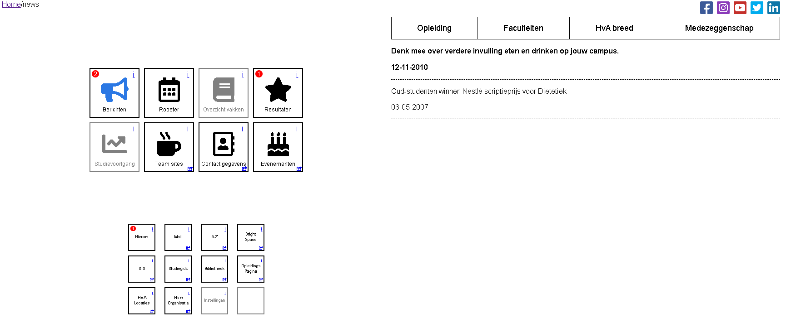
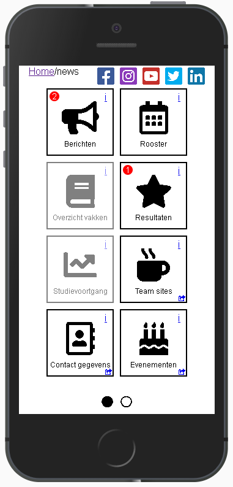
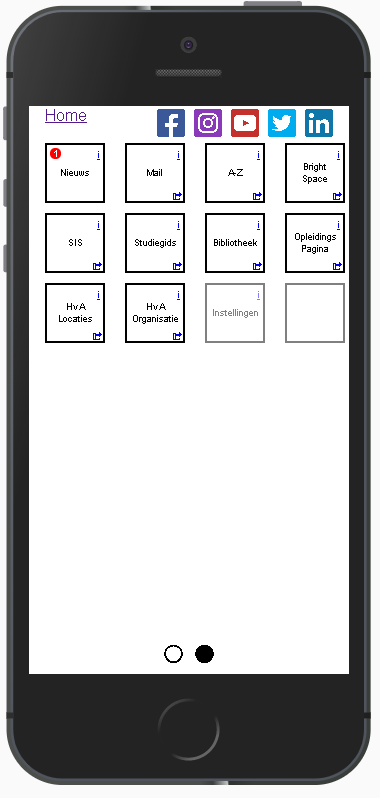

# Meesterproef @cmda-minor-web 1920

## Demo
https://timterwijn.github.io/meesterproef-1920/

## Design rationale

### Debriefing
I am going to build a student portal for the organization Goed Georganiseerd Onderwijs. They are an organization of the HVA that works with students to improve the school.

The GGO has already researched a bit what they and their users want for this student portal application. The students of the HVA would like to have the following information and features inside of the application:

#### Information
##### Primary information
* Schedule
* Course info
* Grades
* Education Progress
* Urgent statements

##### Secondary information
* Statements
* Team sites
* Teacher contact information
* Events

##### Tertiary information
* link to A-Z list
* link to Brightspace
* link to SIS
* Link to education manual
* Link to library
* Link to education page
* Link to HvA addresses
* Link to HvA organization.

#### Problem definition
So the biggest problem that has to be solved is that there are a lot of items that need to fit in one web application. The product owner told us that we should not focus on a specific tool like news to make it pretty, but that we should focus most of our time by figuring out how to solve the space issue by iterating and testing with a student panel.

To solve this problem I thought what I would like to see in this portal. First of all I thought that I did not like to scroll a lot because I hate it to find a part that I need on a page, so that means this portal needs to fit on one page. Secondly I have dyslexia, this means that I like to use a sans-serif font and that I want this application to be simple, you need to understand it with just one look at the screen.

During the final presentation I gave the product owner three tips to improve their version of the portal that are important in my opinion. First of all I believe it is important to create something that is easy and simple to understand like my menu. I noticed that the students really liked it because it was so simple. Secondly I think it is important to add something fun to the portal. In one of my prototypes I showed a text bubble to the students that appears when you press the 'I' button in the menu. They really liked it. Third of all, I think it is important that students do not have to log in all the time when they want to click on a button in the menu.

I had some issues with making quick changes to my portal. I asked for tips to my coach and he told me that I could make use of components. As you can see in figure 1, I tried to split all code apart so that I have a lot of components. Each HTML components is fetched with Javascript as you can see in figure 2. Each CSS component is linked in the main HTML and all JS code is executed after the HTML component is fetched.

Figure 1: My components.

Figure 2: Fetching HTML code.

I've also added some enhancements, first of all I wanted to add a swipe to the mobile menu so that mobile users have a better overview of the menus. By splitting the menu and sub menu the users have a better overview and the small mobile screen is not so crowded. After that the students told me that it was really hard to tell there is an option to swipe. That is why we chose to add some buttons below the screen to show the user he can swipe or to press them to swap from menu.

Figure 3: swipe code.

## Product biography (Think, Make, Check)
### Think
We had a meeting with the guys from GGO (Goed Georganiseerd Onderwijs), they told us what they want a student portal app with the features I described above in the debriefing.

They said it is important to figure out how to design the web page with all the features in mind. So the first thing I am going to do for this project is to create a wireframe I can present next Monday. I do not like endless scrolling inside of an application, and I also do not want to use a classic menu for this application that is why I was inspired to make something like a pocket knife. It's compact, easy to use and it has a lot of tools.

### Make
As you can see in figure one, my prototype is based on a pocket knife. You can use one of the buttons on the left part of the screen to open a tab on the right part of the screen. It is possible to read your Schedule, Grades or Education Progress with the bigger buttons in the top left. The smaller buttons in the bottom left are links to other HvA tools.

And of course as you can see in figure two, it is also possible to visit the site on your mobile phone. The right part of the screen disappears and when you use one of the buttons you either open the Schedule, Grades or Education Progress page and when you use the smaller buttons, you will be redirected to one of the other HvA tools.

Figure 1: My first desktop prototype.

Figure 2: My first mobile prototype.

### Check
So today we had the first demo, I presented my work to the product owners and a lot of students. I gained a lot of useful information what they would like in the app. First of all it is important to see your notifications when you visit the page. The students also wants their unread notifications on top of the list, bolt and maybe some bulbs. There must also be a difference between urgent and normal notifications. Urgent notifications are notifications like last minute schedule changes.

Students also want a pup up when they are leaving the site trough a link for the first time. In this pup up they want information of what they are about to visit. If they proceed, the message is never shown again. You can see this information again when you press the "I" button next to the link. If you do not proceed, the pop up is shown again when you press the link. After you proceed a page is opened in a new tab. It is important that a user does not have to log in again in the opened web page.

Students also like to have access to mail, but it is not so important. It is okay to link to the web mail of the HvA.

### Think
As I said above I need to make some changes to my prototype. First of all, when a user visit the main page, he sees his notifications. I would also like to add some breadcrumbs where users can see where they are on the website and it is possible to go back to the main page quickly. Unread notifications are bolt and on top of the page, and urgent notifications have a red exclamation mark.

When a user clicks one of the buttons for the first time he gets a pup up with the information of that functionality when he accepts the functionality is shown, else he returns to the last screen. If a functionality is accepted the pop up is never shown again unless you press the "i" button next to a functionality button on the left side of the screen.

And I also want to add the mail to the less important buttons.

Some time later I received a mail from Sevval with extra feedback from the students. They gave me the following feedback:
* They want a swipe function to split the homepage of the mobile version in two parts.
* The students want to customize their page so they can decide what is important and what is not for them self.
* News and Notifications need some icon with a number to show how much unreaded things there are.
* One student wanted a name, email and phone number of the teacher in schedule. But I think Name is enough because they can find the teacher inside contacts.

### Make
As you can see the figures below, I made some changes and added some pages. Now you can see the notifications, news, result and schedule page. I also added some icons and a gray background with a colored icon to the selected page. And as you can see in figure 3, 4 and 5 the newest item is on top except for unread items, those are higher and the urgent messages are on top of that.

You can also see the "i" button in each tool button for information and a number if there are unread items inside a tool.

Figure 3: The home and notifications page of the second prototype.

Figure 4: The news page of the second prototype.

Figure 5: The result page of the second prototype.

Figure 6: The schedule page of the second prototype.

Figure 7: The second mobile prototype.

### Check
Today I splitted my demo in three parts. First of all I wanted to ask the student some questions about their wishes from last week. Secondly I wanted to let a student test my app by him self because Koop gave me feedback that I should not present my prototypes. And lastly I presented the things the student had not tested of my prototype.

I wanted to know why the students want their teachers information inside their schedule because there is a teacher contact button. But they told me that sometimes the information is outdated and they would like to see the teacher information as quickly as possible.

Also they wanted the app to be customizable. They want to chose what tool is important for them and what is not. But it does not have any priority. News must be spitted into 4 categories: "opleiding (oc), faculteit stud (fmr) , hva breed (cvbr) and medezeggenschap".

On the app side it is hard to know that there is a swipe function in the menu that is why I need some kind of indicator. Like bubbles that instagram uses.

Lastly the info button must become black if someone has seen its information. And they should only open when someone presses them, not when you open the tool for the first time.

### Think
First of all, I believe it is not smart to show all the information of the teacher inside the schedule. The container has only space for one more piece of text. I want to make it this way that if you click on an item in the schedule you see more, like information about the teacher.

Secondly, I think the customization should be a button inside the less important tools, here you have all the options like customizing your home screen.

Thirdly, to split of news, I want to make a menu in the top part of the news tool, here you can select each of the 4 categories.

### Make
As you can see in figure eight I added a speech bubble when someone presses the "i" button, after the user clicks anywhere it disappears and the "i" button gets disabled by changing to black.

I also make some kind of menu as you can see in figure nine tho split the news into four parts. I do not know how to split them because I can't find anything in the JSON for now, but it is nice to show something new to the students.

I started working the rest of this week on code because I had not done it before. This means that I do not have that much to show to the students this week during the check phase.

Figure 8: Showing the information.

Figure 9: The news page of the third prototype.

### Check
I explained the situation to the students that I do not have many things to show, and they understand. I showed them the two new features and they liked it. Especially the text bubble. It was interesting to see that they told me they liked a fun thing in the demo. It is nice to hear that something I leaned from web design is confirmed by the students. Obe told me that he expected to see all clickable objects for the next demo and that it would be smart to have everything done what I want to test by Friday so that the students can test it at least once.

The students also gave me some feedback, they wanted to see if a button is a link or not and they want Instagram, Facebook and Youtube buttons.

### Think
This week it is important for me to make all the things I want to have tested by the students with real code. Because it is the last week that I can test my work with them. This means that the site will not be 100% accurate and perfect.

I want to make both the menus and at least two clickable buttons so that the student can feel how they can switch pages, I want a mobile version so that the student can give me feedback for that as well.

### Make
As you can see in figure 10, I added some colors, responsive sections and the two menus. Further more I have added the clickable I button with pup up and I have also made the application responsive so you can use it the application on your phone as you can see in figure 11.

Figure 10: The current desktop.

Figure 11: Mobile menu.

Figure 12: Mobile content.

### Check
During the demo I have divided my demo into three parts. First I wanted to ask the students some questions. Then I wanted to test my desktop version and my mobile version with the students.

During one of the last feedback sessions I received from the students they told me that they wanted less attention at the information button. I did not have an idea how to fix this issue so I asked them to help me with this matter. They told me that I could swap the notifications number with the "i" button so the focus would go tho that icon. The other thing I wanted to know was that they said to me last time that they wanted to know when a button is a hyper link and when not. I asked them for ideas and they told me that I could use some kind of icon in the right bottom of a button.

### Think
I know that I have a lot to do now for the final presentation. So I made a list of the things that are the most important. First of all, like the feedback that I received I want to swap the "i" button with the notification number and adding the blue link icon. Furthermore, I want to added more clickable buttons with pages, teacher details in the schedule, social media buttons, unreaded items and lastly customizable menu items in the settings tab.

### Make
As you can see below I was able to add most of the things I wanted to add to the final product, but I was not able to add all the things. I was not able to finish all the things I liked to have completed before the demo, like the customizable menu items, some JSON files and the unread documents. But the product owner told me it is fine because I do not have all the data I needed and I think it this enough to make the product owner happy. He did ask me to give him a list of the items I missed so that they can implement it in their API.

Figure 13: final product.

Figure 14: mobile menu.

Figure 15: mobile sub menu.

### Check
#### Final demo
During the final demo, I showed the product owner, the students, an UX designer and some employees from the HvA my work. After that everybody asked me some questions and give me some feedback. The feedback I learned most from is that the landing page could have been some kind of summary of all the tools instead of the message page.

After both demos we had a short brake and after that the UX designer explained his plans to pick up the project and continue it. It was pretty interesting to see how a real project goes.

#### Expo
The next day we had our last day of class before the summer holidays. We were supposed to present our project results to the teachers and the other students. I have to say I was a bit nervous, but I was glad to see how positive everybody was about my progress. After that we finished the day with a Kahoot!, a small speech and a digital frimibo.

### Wishlist
Here are some things I would like have added for the next sprint and Think Make Check phase:
* Neater design
* Transitions
* Menu customizations
* Fetch from a real API
* Complete the news page with real code (JSON files incomplete)
* Make unreaded documents integer working with code.

## Reflection
### Reflection
#### Web app from scratch
##### Rubric
When a user presses one of the internal menu buttons, HTML code is fetched from the server containing the specific component, this data is manipulated with another promise with a fetch requesting data from a JSON file (API in the future). After that the data is served into the HTML. The buttons that start this algorithm are messages, schedule, results and news. I used this promise with a fetch because I think it is an easy and readable way of receiving external data.

##### Other things
I had some issues with making quick changes to my code because it gets a mess really quickly. During one of my reviews I learned from the teachers that I can split my HTML in several components, by giving a component an id, and using CSS from there, "#id&gt;article&gt;section", I learned that you can keep your code pretty clean. I could even split my JavaScript files with it and fetch the html code.

#### Css to the rescue
##### Rubric
Something I really liked about this course it that I learned about cascade, inheritance and specificity, before this course I was always using Bootstrap (Eww) and a lot of ugly classes inside my HTML. Lucky for me, I tried to use no id's classes as challenge during this source AND I also stayed below the 5KB limit, which I am really proud of. Because of using this I learned to work with a clean HTML and using selectors in the CSS. As I said above, I improved this way of coding even more by applying components and using ID's for a component, "#id&gt;article&gt;section". I believe this is a good way of working because this makes my CSS smaller and splits it up in multiple smaller CSS files with a master CSS for general code like ".hidden{opacity:0;}".

##### Other things
During this course I learned to work with grids, from that point one I used grids for everything because I did not know how to position items in a container in another way. During this master test I stumbled upon the CSS position attribute. With position absolute it is possible to place a piece of HTML anywhere in the parent container class if you make the parent position relative. This is so much faster for me that to use grids for all small containers. I still use grids for larger containers though. It is very handy to make a web app responsive.

#### Progressive web-app
##### Rubric
I have also added a Service worker. This service worker is been setup after the page has been loaded so that it can cache all the displayed files. I have done this so that a user can use this web app when his internet is bad or he has no internet at all.

#### Browser tech
##### Rubric
Now that I read the rubric I realized that I did something stupid, I tried to working with the 3 layers, but with working with components I totally forgot to test the application without JavaScript. The application does work on internet explorer, layer one, I detect an old browser with "<script nomodule>" and a new one with " <script type="module">. The script tag of the new browser contains all the original JavaScript code. But the old browser JavaScript tag uses other code. I could not complete the old browser JavaScript file due to having a real deadline, however I made it possible to see the messages tab, and with the help of CSS @supports (display: grid) I have styled the application for older browsers, layer two. The web app is not complete as I have said before, you can not use the internal buttons, but the links to external HvA apps do work. Finally I have added a cool enhancement, layer three, where it is possible to swipe between menus in the mobile version of the application. I believe it is important to add support for older browser to your application because there are a lot of people who do use the older browsers, some with some without JavaScript. It is also important to take other things in account, like color blind people, people who need tabs to use your app etc. I did use anchor tags for my menu so users can use the tab buttons to navigate, but for reasons some other components are not using anchors, so sadly I have to admit my web app does not 100% supports tabbing, more like 80%, however I do believe it is a really important feature.

#### Realtime web
##### Rubric
None, I made the choice to spend my time with designing and iterating and not setting up a whole server. And I also believe I have enough experience with setting up a server. I believe I can learn the most from UX and designing. I made this choice because the product owner told us that the most important thing (scope) was tho solve the problem to fit all the tools of the HvA in one application. This is the reason I did not use anything I have learned from realtime web. But that does not mean I did like or learned things from course.

#### Web design
##### Rubric
This is the real reason I chose this project. During my web design classes I had not the chance to test in a proper way, because I had to work with Marie. Marie is not a bad person, but because she is Deaf and we have to work from home, I could not let her test my application on her device without seeing what she does. She could also not talk/listen and use the application at the same time because of her being Deaf and using her tolks. This time I could test with all the students from the student panel, communicate with them and ask them what their thoughts where during the tests. I think it is important to test properly because I noticed during the tests that there are always things you as developer see different than someone who is not a developer, like the student panel during this project. By working in sprints with the think make check cycle you find those differences as soon as possible to save a lot of time and effort at the end of the project. Please check out my Product biography if you want to read how those tests have resolved and resulting in my final project.

##### Other things
A big thing that I have learned is that I thought to be smart to keep prototyping as long as possible. I thought that if I keep prototyping on paper it would be easier to make changes in the last part of the project. But I have learned that I was wrong. I had a lot of stress during the latter weeks of the project because I started working on code only at the end of the third week and that is why there are a lot of things that I wish to be in the final product that have not been added because of the time shortage. Because of this project I now know that if I split my HTML, CSS and JavaScript into pieces, components, I can have a faster result and can make quicker changes to my code so I do not have to prototype forever.

### Reviews
#### Week 2
##### Code
I talked with Janno about my issue that I would not like to use a server and a real time application. Because I think the product owner does not need one for his requirements. Also, I think I can learn the most as an ICT student if I focus on the UX part of this project. Janno told me that I could focus on the WAFS, BT and PWA courses by using a client side app with JSON with three layers and faster loading. But I have to ask Koop and Joost first to be sure if it is okay. He also mentioned that it would be cool to make use of progressive disclosure, I told him about my pocket knife choices and that I already unintentional made use of it. But I am going definitely research progressive disclosure in a few days.

##### Design
I talked with Koop about my designs. He told me that it was useless to test the way I am testing now. I should let the students test my work. This is something I am going to do tomorrow by letting the users downloading a PDF. He also told me that the pocketknife type of prototype most of the times is not going to work. However, the demo is tomorrow so I have decided to let my users decide if they think the prototype is not helpful. I also asked Koop about the server, but he wanted to make a different meeting for that.

#### Week 3
##### Code
This week I talked again with Janno and I told him that I have a lot to write and to prototype. This takes a lot of my time and I do not have the time to write code yet. I asked him if he had any tips for me. He told me that I should tell the product owner that I also have a deadline and I should focus on coding. He also told me that small changes are okay but should not allow big changes. I agreed with him. Later that day I also had a weekly stand up with Koop. I told him about myconversation with Janno, but he disagrees. He told me that it is okay if I the product owner would like big changes in the last week because a happy product owner (and students in my case) are important for this project. He also said to me that it was really important that I started coding this week as soon as possible. I asked him if I do not waste a lot of time if I start code now because editing code takes a lot of time. He did disagree again, he told me that if I do it right by having a clean HTML and a CSS it would not take a lot of time. After that I made the decision to add the last most important things to the prototype, then start coding as soon as possible.

##### Design
I had a meeting with Vasilis this week, I already talked with Koop this week so I liked to talk to someone else this week. Yesterday Koop told me that it would be easier for me to make quick changes to my code if I have a cleaner HTML and CSS. I asked Vasilis today how I could do this. He told me that if I split my code into smaller components it would be a lot easier. I could use imports for it or I could even use a lot of comments. I told him that my CSS is also a big soup of code and that I still use a lot of the selectors I have learned from CSS to the rescue. He told me that that is okay because they are strong selectors. However, he agreed with me that those selectors get a mess really quickly. To solve this problem I could give a component an ID or a class, then use those old selectors on top of that component in another file to make my code cleaner.

#### Week 4
##### Code
I talked with Janno about using components, and how I can do it in the best way. He told me that I could use handlebars. I did not know anything about them, but it is quite simple, with handlebars you can print a string from an object to HTML so it looks really nice. However, after reading the docs I have decided that I keep using my old Components because I do not have that much time left. I do however want to use handlebars in the future when I am working on a new project when I need components.

##### Design
I had a meeting with Vasilis again this week. I showed him my prototypes and wanted feedback what I could add from CSS to the rescue. He was a bit surprised that I showed a prototype a week before the deadline. I explained him my situation and showed him my result page. He said that I should not always add stuff but I could also remove some things. He said that borders are too much of a distraction. I could remove them entirely or just keep the border bottom. He also told me that I could add things like border shadow, border radius and some colors. I agreed but I have decided that I want to ask the students what they want next Friday so that I can keep focusing on the things that needs testing for Friday.
