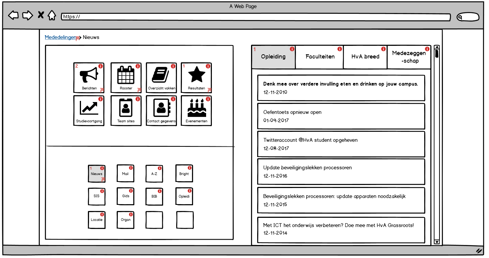
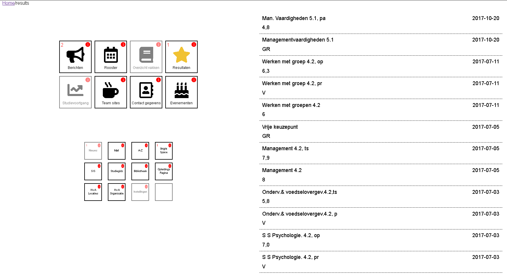

# Meesterproef @cmda-minor-web 1920

## Demo
https://timterwijn.github.io/meesterproef-1920/

## Design rationale

### Debriefing
I am going to build a student portal for the organization Goed Georganiseerd Onderwijs. They are an organization of the HVA that works with students to improve the school.

The GGO has already researched a bit what they and their users want for this student portal application. The students of the HVA would like to have the following information and features inside of the application:

#### Information
##### Primary information
* Schedule
* Course info
* Grades
* Education Progress
* Urgent statements

##### Secondary information
* Statements
* Team sites
* Teacher contact information
* Events

##### Tertiary information
* link to A-Z list
* link to Brightspace
* link to SIS
* Link to education manual
* Link to library
* Link to education page
* Link to HvA addresses
* Link to HvA organization.

##### Other information
* Waar moet mail komen?
* Waar moet news komen?

### Problem definition
So the biggest problem that has to be solved is that there are a lot of items that need to fit in one web application. The productowner told us that we should not focus to make a specific part like news of the design pretty, but that we should focus most of our time by and figure out how to solve this problem by iterating and testing with students.

To solve this problem I thought what I would like to see in this portal. First of all I thought that I did not like to scroll because I hate it to find the part that I need, so that means this portal needs to fit on one page. Secondly I am a dyslectic, This means that I want to use a sans-serif font and that I want this application to be simple, you need to understand it with just one look at the screen. After this I tested a lot and iterated with the students to create the demo I have created now.

During the final presentation I gave the productowner three tips for their version of the protal that are important in my opinion. First of all I believe it is important to create something that is easy and simple to understand like my menu. I noticed that the students really liked it because it was so simple. Secondly I think it is importand to add something fun to the portal. In one of my prototypes I showed a text bubble to the students when you press an I button in the menu. They really liked it. Third of all, I think it is imortant that students do not have to log in all the time when they want to click on a button in the menu.

I had some issues with making quick changes to my portal. I asked for tips to my coach and he told me that I could make use of components. As you can see in fugure 1, I tried to split all code apard so that I have a lot of compents. Each HTML components is fetched with Javascript as you can see in figure 2. Each CSS component is linked in the main HTML and all JS code is executed after the HTML component is fetched. 

  
Figure 1: My components. 

  
Figure 2: Fetching HTML code. 

I've also added some enhancements, first of all I wanted to add a swipe to the mobile menu so that users have a better overview of the menus. By splitting the menu and submenu I can 

#### Features
* All information must be available on one location.
* MijnHvA.nl and MijnHvApp must contain the same information and must look and feel the same as the new app.
* The portal looks and apps must be customizable by a user.
* Students wants to receive push notifications when changes occur in their schedule, when they receive a new grade and when a course has new information.
* Course overview must have a link to brightspace.
* All customizable options and settings must be visible on one page.
* Customizable and personal news.
* Customizable push notifications, both layout and the content.

#### Final notes
* The app must be actual, real time, personal and school related.
* Students wants to know the difference between news en Statements.
* Absence of teachers is only useful when the app is real time.
* Schedule needs to have holidays and deadlines.

## Product biography (Think, Make, Check)
### Think
We had a meeting with the guys from GGO (Goed Georganiseerd Onderwijs), they told us what they want a student portal app with the features I described above in the debriefing.

They said it is important to figure out how to design the web page with all the features in mind. So the first thing I am going to do for this project is to create a wireframe I can present next Monday. I do not like endless scrolling inside of an application, and I also do not want to use a classic menu for this application thats why I was inspired to make something like a pocket knive. It's compact, easy to use and it has a lot of tools.

### Make
As you can see in figure one, my prototype is based on a pocket knife. You can use one of the buttons on the left part of the sceen to open a tab on the right part of the screen. It is possible to read your Schedule, Grades or Education Progress with the bigger buttons in the top left. The smaller buttons in the bottom left are links to other HvA tools.  

And of course as you can see in figure two, it is also possible to visit the site on your mobile phone. The right part of the screen dissapears and when you use one of the buttons you eigther open the Schedule, Grades or Education Progress page or when you use the smaller buttons, you are send to the other HvA tools.  

  
Figure 1: My first desktop prototype.  

  
Figure 2: My first mobile prototype.  

### Check
So today we had the first demo, I presented my work to the product owners and a lot of students. I gained a lot of usefull information what they would like in the app. First of all it is importand to see your notivications when you visit the page. The students also wants their unread notivations on top of the list, bolt and maybe some bulbs. There must also be a diffrence between urgend and normal notivications. Urgent notivications are notivications like last minute schedule changes.  

Students also want a pupup when they are leaving the site trough a link for the first time. In this pupup they want information of what they are about to visit. If they procede the message is never shown again. You can see this information again when you press the I next to the link. If you do not procede, the popup is shown again when you press the link. After you procede a page is opened in a new tab. It is important that an user does not have to log in again in the opened webpage.

Students also like to have access to mail, but it is not so important. It is okay to link to the webmail of the HvA.  

### Think
As I said above I need to make some changes to my prototype. First of all, when a user visit the main paige, he sees his notivications. I would also like to add some breadcrumbs where users can see where they are on the website and it is posible to go back to the main page quickly. Unreaded notivication are bolt and on top of the page, and urgent notivications have a red exclamation mark.

When an user clicks one of the buttons for the first time he gets a pupup with the information of that functionality when he accepts the functionality is shown, else he returns to the last screen. If an functionality is accepted the popup is never shown again unless you press the I next to a functionality button on the left side of the screen.

And I also want to add the mail to the less important buttons.

Some time later I received a mail from Sevval with extra feedback form the students. They gave me the following feedback:
* They want a swipe function to split the homepage of the mobile version in two parts.
* The students want to customize their page so they can decide what is importand and whats not for them self.
* News and Notifications need some icon with a number to show how much unreaded things their are.
* One student wanted a name, email and phone number of the teacher in schegual. But I think Name is enough because they can find the teacher inside contacts. 

### Make
As you can see the figures below, I made some changes and added some pages. Now you can see the notivications, news, result and schedule page. I also added some icons and a gray background with a coloured icon to the selected page. And as you can see in figure 3, 4 and 5 the newest item is on top except for unread items, those are higer and the urgent messages are on top of that.

You can also see the i in each tool button for information and a number if there are unread items inside a tool.

  
Figure 3: The home and notivcations page of the second prototype.

  
Figure 4: The news page of the second prototype.

  
Figure 5: The result page of the second prototype.  

  
Figure 6: The schedule page of the second prototype.    

  
Figure 7: The second mobile prototype.  

### Check
Today I splitted my demo in three parts. First of all I wanted to ask the student some questions about their wishes from last week. Secondly I wanted to let a student test my app by him self because Koop gave me feedback that I should not present my prototypes. And lastly I presented the things the student had not tested of my prototype.

I wanted to know why the students want their teachers information inside their schedule because there is a teacher contact button. But they told me that sometimes the information is outdated and they would like to see the teacher information as quickly as possible. 

Also they wanted the app to be customizable. They want to chose what tool is important for them and what is not. But it does not have any priority. News must be spitted into 4 categories: "opleiding (oc), vakeltijd stud (fmr) , hva breed (cvbr) and medezegingscahap".

On the app side it is hard to know that there is a swipe function in the menu thats why I need some kind of indicator. Like bubbles thats instagram uses.

Lastly the info button must become black if someone has seen its information. And they should only open when someone press them, not when you open the tool for the first time.

### Think
First of all, I believe it is not smart to show all the information of the the teacher inside the schedule. The container has only space for one more piece of text. I want to make it this whay that if you click on an item in the schedule you see more, like information about the teacher.

Secondly, I think the customization should be a button inside the less importand tools, here you have all the options like customizing your home screen.

Thirdly, to split of news, I want to make a menu in the top part of the news tool, here you can select each of the 4 categories.

### Make
As you can see in figure eight I added a speech bubble when someone presses the I button, after the user clicks anywhere it disapears and the I button gets disabled by changing to black. 

I also make some kind of menu as you can see in figure nine tho split the news into four parts. I do not know how to split them because I can't find anything in the JSON for now, but it is nice to show something new to the students. 

I started working the rest of this week on code because I had not done it before. This means that I do not have that much to show to the students this week during the check phase.

  
Figure 8: Showing the information.  

  
Figure 9: The news page of the third prototype.

### Check

I explained the situation to the students that I do not have many things to show, and they understand. I showed them the two new features and they liked it. Obe told me that he wanted to see all clicks and that it would be smart to have everything done what I want to test by vriday so that the students can test it one more time.

The students also gave me some feedback, they wanted to see if a button is a link or not and they want Instagram, Facebook and Youtube buttons.

### Make

This week it is importand for me to make all the thinks I want to have tested by the students. Because it is the last week that I can test my work with them. This means that the site will not be 100% accurate and perfect. As you can see in figure 10, I added some colours, responsive sections and a hamburger menu.

  
Figure 10: The current desktop.

  
Figure 11: Mobile menu.

  
Figure 12: Mobile content.

### Check

During the demo I devided my demo into three parts. First I wanted to ask the students some questions. Then I wanted to test my desktop version and my mobile version with the students.

In one of the last feedbacks I received from the students they told me that they wanted less less atention at the information button. I did not have an idea how to fix this issue so I asked them to help me with this matter. They told me that I could swap the notivacations number with the I so the focus would go tho that icon. The other thing I wanted to know was that they said to me last time that they wanted to know when a button is a hyper link and when not. I asked them for ideas and they told me that I could use some kind of icon in the right bottom of an button.

## Reflection
### Week 2
#### Code
I talked with Janno about my issue that I would not like to use a server and a real time application. Because I think the product owner does not need one for his requirements. Also I think I can learn the most as an ICT student if I fucus on the UX part of this project. Janno told me that I could focus on the WAFS, BT and PWA courses by using a client side app with JSON with three layers and faster loading. But I have to ask Koop and Joost first to be sure if it is okay. He also mentioned that it would be cool to make use of progressive disclosure, I told him about my pocket knive choices and that I already unintentional made use of it. But I am going definitely reasearch progressive disclosure in a few days.  

#### Design
I talked with Koop about my designs. He told me that it was useless to test the way I am testing now. I should let the students test my work. This is something I am going to do tomorrow by letting the users downloading a PDF. He also told me that the pocketknive type of prototype most of the times is not going to work. However the demo is tomorrow so I have deceided to let my users deceide if they think the prototype is not helpfull. I also asked Koop about the server, but he wanted to make a diffrent meeting for that.

### Week 3
#### Code 
This week I talked again with Janno and I told him that I have a lot to documentate and to prototype. This takes a lot of my time and I do not have the time to write code yet. I asked him if he had any tips for me. He told me that I should tell the product owner that I also have a deadline and I should focus on coding. He also told me that small changes are okay but should not allow big changes. I agreed with him. Later that day I also had a weekly standup with Koop. I told him about my converversation with Janno, but he disagrees. He told me that it is okay if I the product owner would like big changes in the last week because a happy product owner (and students in my case) are important for this project. He also said to me that it was really important that I started coding this week as soon as possible. I asked him if I do not waste a lot of time if I start code now because edditing code takes a lot of time. He did disagrees again, he told me that if I do it right by having a clean html and a css it would not take a lot of time. After that I made the decicion to add the last most important things to the prototype, then start coding as soon as possible.

#### Design  
I had a meeting with Vasilis this week, I already talked with Koop this week so I liked to talk to someone else this week. Yesterday Koop told me that it would be easier for me to make quick changes to my code if I have a cleaner HTML and CSS. I asked Vasilis today how I could do this. He told me that if I split my code into smaller components it would be a lot easier. I could use imports for it or I could even use a lot of comments. I told him that my CSS is also a big soup of code and that I still use a lot of the selectors I have learned from CSS to the rescue. He told me that that is okay because they are strong selectors. However he agreed with me that those selectors get a mess really quickly. To solve this problem I could give a component an ID or a class, then use those old selectors on top of that component in another file to make my code cleaner.

### Week 4
#### Code
I talked with Janno about using components, and how I can do it in the best way. He told me that I could use handlebars. I did not know aanything about them, but it is quite simple, with handlebars you can print a string from an object to html so it looks really nice. However after reading the docs I have deceided that I keep using my old Components because I do not have that much time left. I do however want to use handlebars in the future when I am working on a new porject when I need components. 

#### Design  
I had a meeting with Vasilis again this week. I showed him my prototypes and wanted feedback what I could add from CSS to the rescue. He was a bit supprised that I showed a prototype a week before the deadline. I explained him my situation and showed him my result page. He said that I should not always add stuff but I could also remove some things. He said that borders are to much of an destraction. I could remove them entirly or just keep the border bottom. He also told me that I could add things like border shadow, border radius and some colours. I agreed but I have deceided that I want to ask the students what they want next vriday so that I can keep focusing on the things that needs testing for friday.
